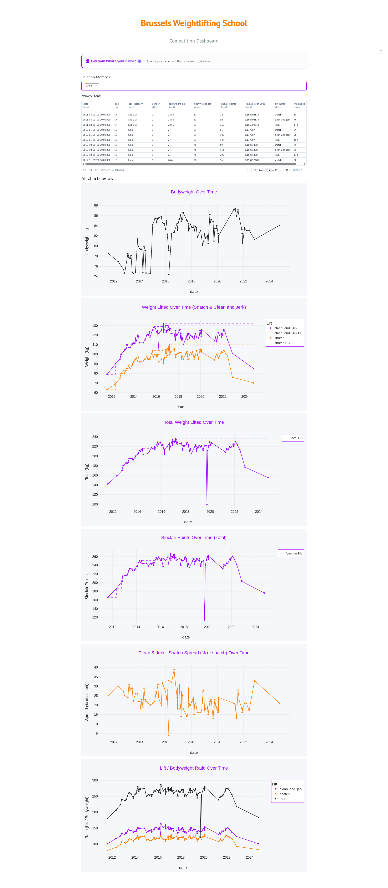
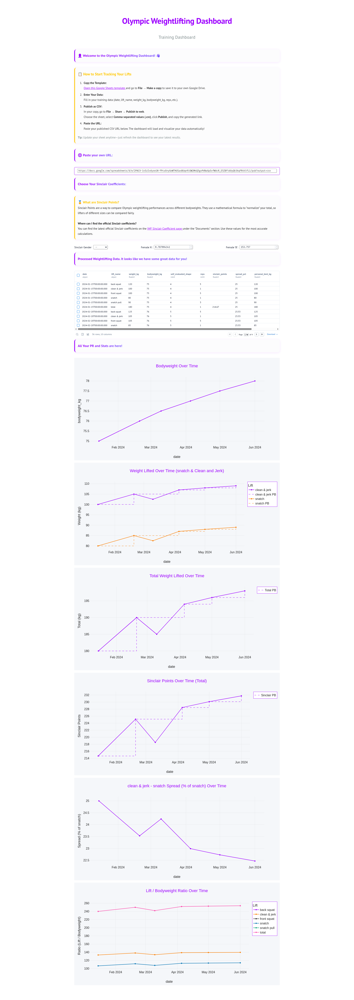

# Olympic Weightlifting Statistics Dashboard

Welcome! This dashboard helps you visualize and analyze your Olympic weightlifting training and competition data. Track your progress, compare lifts, and see your Sinclair points—all in one place.


## 🚀 Quick Start

### 1. Choose Sinclair Gender & Coefficients

- At the top, select **Sinclair Gender**: "Male" or "Female".
- Standard Sinclair coefficients (A & B) will appear. You can adjust them if needed (e.g., for the latest IWF tables).

### 2. Prepare Your Training Data (CSV)

> 📋 **How to Start Tracking Your Lifts**
>
> 1.  **Copy the Template:**
>     [Open this Google Sheets template](https://docs.google.com/spreadsheets/d/1sOvuFj0_LtxaDD6gCrLZJSfJ0HYku9xLoonkTIPCFIc/edit?gid=1543506157#gid=1543506157) and go to **File → Make a copy** to save it to your own Google Drive.
> 2.  **Enter Your Data:**
>     Fill in your training data (date, lift\_name, weight\_kg, bodyweight\_kg, reps, etc.).
> 3.  **Publish as CSV:**
>     In your copy, go to **File → Share → Publish to web**.\<br\>
>     Choose the sheet, select **Comma-separated values (.csv)**, click **Publish**, and copy the generated link.
> 4.  **Paste the URL:**
>     Paste your published CSV URL below. The dashboard will load and visualize your data automatically\!
>
> **Tip:** Update your sheet anytime—just refresh the dashboard to see your latest results.


Your Google Sheet file **must** have these columns:

| Column                | Example         | Description                                  |
|-----------------------|----------------|----------------------------------------------|
| `date`                | 2023-10-27     | Date of the lift (YYYY-MM-DD)                |
| `lift_name`           | Snatch         | Name of the lift (e.g., Snatch, Clean & Jerk)|
| `weight_kg`           | 105.5          | Weight lifted (kg)                           |
| `bodyweight_kg`       | 77.2           | Your bodyweight on that day (kg)             |
| `self_evaluated_shape`| 4              | How you felt (1=bad, 5=great)                |

**Sample Data:**
```csv
date,lift_name,weight_kg,bodyweight_kg,self_evaluated_shape
2023-01-15,Snatch,90,75.5,3
2023-01-15,Clean & Jerk,110,75.5,3
2023-01-17,Snatch,92.5,75.8,4
2023-01-17,Clean & Jerk,115,75.8,4
2023-01-19,Front Squat,150,76.0,5
```

**Tips:**
- Column names must match exactly.
- Dates: `YYYY-MM-DD`.
- Use `.` for decimals (e.g., `75.5`).

## 🏆 Competition Dashboard

Track and compare competition results for all club members using a shared Google Sheet.

### How It Works

- Open the **Competition Dashboard** (via Marimo app or web).
- Data loads automatically from the club’s Google Sheet—no upload needed.
- Explore charts and tables for all athletes: Sinclair points, bests, and more.
- Filter by athlete, lift, or competition.

### Adding Competition Results

1. **Open the shared Google Sheet** (ask your admin for the link if needed).
2. **Add your results** as a new row. Follow the sheet’s format—don’t change columns or headers.
3. **Use correct formats:**
   - Dates: `YYYY-MM-DD`
   - Decimals: use `.`
4. **Don’t overwrite others’ data.** Double-check your entries.

Your updates appear in the dashboard automatically.

## 💡 Need Help?

- For feature requests or bugs, open an issue on GitHub.

Enjoy tracking your progress!



